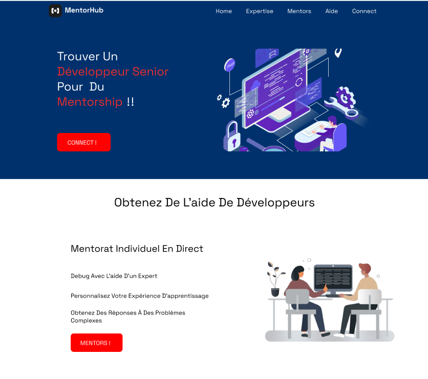

## Mentor Hub

### How to get started ?

```bash
npm run dev
# or
yarn dev
# or
pnpm dev
# or
bun dev
```
### Launch the app

Open [http://localhost:3000](http://localhost:3000) with your browser to see the result.

## Screens




## UI Design

[Figma File](https://www.figma.com/file/7dQzIN2yqsK2T9M0fWDluJ/MentorHub__?type=design&node-id=5%3A2&mode=design&t=r4YljrLhQtOuliD4-1)
=======